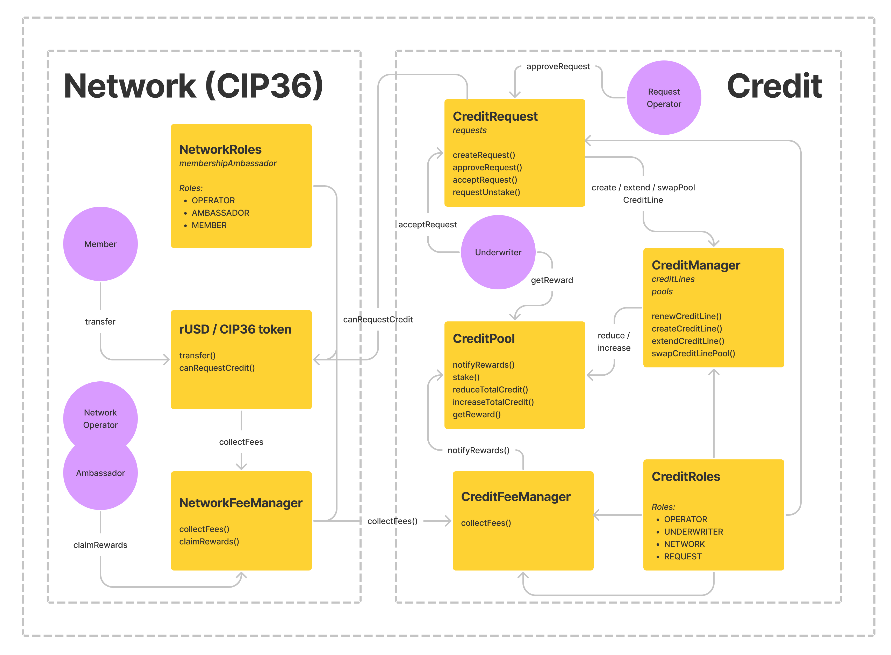

---

# ☝️ Protocol Overview



The above diagram depicts how the ReSource network utilizes the ReSource protocol to issue and secure debt for its members.

In order for any mutual credit network to utlize the ReSource credit protocol, the network must use the _CIP36_ standard of mutual credit currency.

Shown above is the seperation of network fees and credit fees. In addition to the credit fees used to incentivise debt collateralization, networks may choose to collect a network fee.

Also shown is the process of requesting, issueing, and collateralizing credit lines for specific networks. The ReSource network and protocol are authorized with distinct roles.

###ReSource Network Roles:

- **Network Operator**: Manage network fee structure, claim network rewards, and can grant ambassador role access.
- **Ambassador**: Manage memberships created from granting members access. Ambassadors are also authorized to request credit on behalf of their members.
- **Member**: CIP36 transactions.

###Credit Roles:

- **Credit Operator**: Manage credit fee structure, credit pool registration, and claiming credit fee rewards (if a credit line is unassigned to a pool).
- **Underwriter**: Manage credit pool rewards, credit line pool assignment, and claim credit fee rewards for credit lines associated with managed pools.
- **Request Operator**: Approve and manage credit requests created by authorized network participants.

  ***

# 🏄‍♂️ Quick Start

> install dependancies

```bash
yarn
```

> start hardhat chain

```bash
yarn chain
```

> deploy contracts to local hardhat chain

```bash
yarn deploy
```

🔏 Contract deployments are stored in `packages/hardhat/deployments/<network>/<contract_name>`

# 🏗 Run Contract Tests

```bash
yarn test
```

# 🤓 Details

> Local graph node

```bash
yarn run-graph-node
```

> if old graph node, clean graph node

```bash
yarn clean-graph-node
```

> build and deploy the subgraph

```bash
yarn graph-prepare
yarn graph-codegen
yarn graph-build
yarn graph-create-local
yarn graph-deploy-local
```

🔏 smart contracts in `packages/hardhat/contracts`

💼 Deployment scripts in `packages/hardhat/deploy`

📕 Go to our home page to learn more : https://www.resourcenetwork.co/
